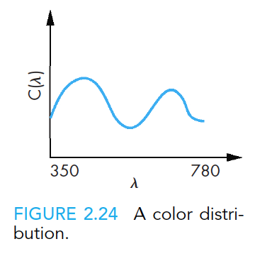
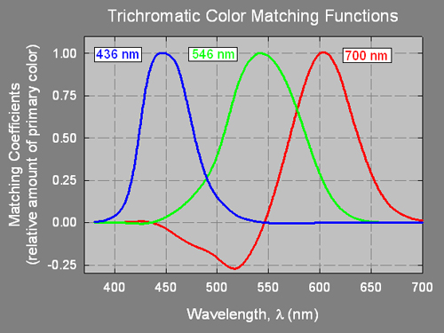
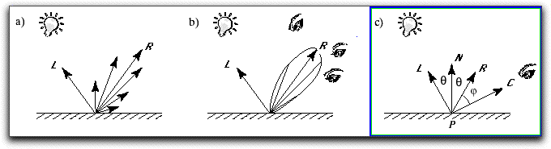

# Homework 3 - B481 / Spring 2018

**Name:** Matthew Lonis

**Username:** mrlonis

**Date:** 29 March 2018

## Table of Contents

- [A.1 Answer](#a1-answer)
- [A.2 Answer](#a2-answer)
- [A.3 Answer](#a3-answer)
- [B.1 Answer](#b1-answer)
- [B.2.a Answer](#b2a-answer)
- [B.2.b Answer](#b2b-answer)
- [C.1 Answer](#c1-answer)
- [C.2 Answer](#c2-answer)
- [C.3 Answer](#c3-answer)

## Foreward

**Before** attempting to answer the questions in Homework 03 tasks, read Chapter 2 Part 5, and all of Chapter 5, in the Angel/Shreiner textbook.

## A. Color [30 points]

### 1. [10 points] What is the physical origin of color?

For full points, you need to very briefly describe:

- How to represent physical quantities (not just qualities) of light in the visible spectrum, in a numerical, measurable way?
- In that representation, how are two colors considered to be distinct from each other?

*Note:* in this question, we're considering **_physically measurable colors_**, **_not_** the concept of color as perceived by human subjects.

#### A.1 Answer

The physical quantities of a color can be represented by two things. The first quantity is the wavelength (λ) of a color which varies between 350 to 780 nanometers. The second quantity is C(λ) which represents the _intensity_ of the color or how much of it is present. These two quanitites represent a color as shown in Figure 2.24 on page 67 of the Angel/Shreiner textbook (and shown below).

Two colors are therefore different if their C(λ) values are different not necessarily different λ values. Although humans cannot perceive the differences in C(λ) for colors with similar λ, the colors are still measurably different physically.

**_End of A.1 Answer_** [Back to Table of Contents](#table-of-contents)

### 2. [10 points] Why do most computer graphics displays emit three colors of light: red, green, and blue?

For full points, you need to very briefly describe:

- Why three colors --- and not, for example, two or four?
- Why red, green and blue --- and not, for example, orange, violet, and pink?

#### A.2 Answer

Computer graphics displays emit three colors of light, rather than four or two colors, because the human visual system has three color sensing cones, each of which are centered on three distinct wavelengths of color.

The reason most displays use red, green and blue is due to these three cones being centered on red, green and blue respectively. This is illustrated in the picture below.

 Furthermore, when emitting light, an additive color systems is needed in order to replicate all the colors of light and red, green and blue can be used for additive color since they are primary colors.

**_End of A.2 Answer_** [Back to Table of Contents](#table-of-contents)

### 3. [10 points] How can one convert a _physical_ color _description_ (as from question A.1), into a _perceptually relevant_ color _description_?

For full points, you need to very briefly describe:

- How would a _quantitative_ representation of color from the above answer (A.1) be **_converted_** to a _quantitative_ description of color that is motivated by a model of color perception in the human visual system?

#### A.3 Answer

To convert a quantitative representation of color from A.1, we merely need to plot the value C(λ) in the graph below. From there, we draw a vertical line upwards and downwards towards the vertical edges of the graph marking where the line crosses on any of the color bands.

From there, we find where the vertical line crossed the line of each of the three of the color bands and take note of its Matching Coefficients. Once we have the values for all three colors, we have a way to convert the physical color description into a perceptually relevant color description since we have values for red, green and blue.

It is important to note that the line drawn will always cross each of the three color bands at exactly one point per band due to the overlapping nature of the bands.

**_End of A.3 Answer_** [Back to Table of Contents](#table-of-contents)

## B. Ambient Illumination and Diffuse Illumination [50 points]

### 1. [10 points] Let's consider Lambert's Law for modeling a diffusely reflective surface. To answer this question, consider:

- a 3D environment with a single, fixed, finite-distance, point-sized light source,
- a fixed, single illuminated flat surface, with finite area A,
- a _**moving** observer_, i.e. assume that the observer is going to be at different positions relative to the illuminated surface.
- Also, assume that the _distance attenuation_ factor can be neglected.

In your own words (i.e. you don't need to use a mathematical expression), explain: **What does Lambert's Law say about the _intensity_ (as perceived by such observer) of the diffuse reflected light coming from the area A?**

#### B.1 Answer

Lambert's Law says the intensity of the diffuse reflected light coming from area **A** will be brightest when the light source is parallel to the reflecting surface and dimmest when the light source is perpendicular to the reflection surface.

Furthermore, Lambert's law states we only see the vertical portion of the reflected light giving rise to the cosine law in Lambert's equation. The mathematical expression for the _intensity_ (as perceived by such observer) of the diffuse reflected light coming from the area **A** is merely a portion of the original intensity.

**_End of B.1 Answer_** [Back to Table of Contents](#table-of-contents)

### 2. [40 points]

Given:

- let **Lworld** be the light position (as a point≡vector in 3D space),
- let **Cworld** be the camera position (as a point≡vector in 3D space),
- let **Pworld** be the vertex position (as a point≡vector in 3D space) on a smooth surface, with (given) unit normal direction **_N_** at that vertex.

where all above coordinates are provided as world coordinates, i.e. coordinates that are relative to a world coordinate system which may be centered and oriented arbitrarily. In answering the questions below, all quantities must be computed from the vectors **Pworld**, **Lworld**, **Cworld**, and **_N_**, as defined above.

In your answers, you may compute and use some or all of the following vectors, _if_ you find _any_ of them useful:

- let **C** be the _normalized_ unit vector pointing **_to_** the camera (or viewer) **_from_** the current vertex **P**.
- let **L** be the _normalized_ direction pointing **_to_** the light source **_from_** the current vertex **P**.
- let **R** be the _normalized_ direction of a light ray that is _specularly_ reflected at the current vertex **P**.

You also may find the following illustration useful:

Assuming all the above, answer these questions _(In all the answers where a mathematical expression is required, your answers should contain sufficiently explicit mathematics that the reader could write a program)_:

#### a. [10 Points] What physical process does the _ambient color_ (as used e.g. in OpenGL) for an object's _material specification_ approximate? (answer in your own words, not with a mathematical expression)

##### B.2.a Answer

The physical process the ambient color for an object's material specification approximates how much light is reflected by ambient lighting since some of the light is absorbed by the material itself and only a portion is reflected. The fraction of light allowed to be reflected is a value _x_ that is between 0 and 1 inclusively.

**_End of B.2.a Answer_** [Back to Table of Contents](#table-of-contents)

#### b. [30 points] What is the mathematical expression for _the geometric factor_ for **diffuse illumination**, as dependence on the vectors given above?

For full credit, you must say when this component vanishes, and express your answer in terms of **Pworld**, **Lworld**, **Cworld**, and of course **_N_**. (answer with a mathematical expression)

_Hint: your answer cannot depend on the coordinate system origin._

##### B.2.b Answer

The mathematical expression for the geometric factor for diffuse illumination, as dependence on the vectors given above, is ((**Lworld** - **Pworld**) · **_N_**) * (**Cworld** - **Pworld**) · **_N_**).

Diffuse illumination as seen on page 268 of the book doesn't make use of **Cworld**. In fact when I looked up online more about diffuse illumination, I stumbled upon this Wiki article about the Phong reflection model ([https://en.wikipedia.org/wiki/Phong_reflection_model](https://en.wikipedia.org/wiki/Phong_reflection_model)) in which the only real usage of **Cworld** is when calculating the entire intensity by taking into acount specular reflection.

Needless to say, this problem was extremely difficult and I really don't know if my answer is anywhere close to correct. Could we go over this in class? I've read Chapter 5 about 4 times now and still don't understand the question enough to answer it despite feeling confident in my understanding of diffuse illumination.

**_End of B.2.b Answer_** [Back to Table of Contents](#table-of-contents)

## C. Flat Shading and Gouraud Shading [20 points]

### 1. [5 points] Which one is required for the "flat shading model" to get the proper effect: one normal per _face_, or one normal per _vertex_?

#### C.1 Answer

One normal per face is required for the "flat shading model"  to get the proper effect.

**_End of C.1 Answer_** [Back to Table of Contents](#table-of-contents)

### 2. [5 points] If you were to implement a hardware-accelerated Gouraud shading interpolation, which feature of contemporary graphics processors would you use, and how would you use it? (answer in your own words, not with a mathematical expression)

#### C.2 Answer

If I were to implement a hardware-accelerated Gouraud shading interpolation, I would use parallelism, a feature of contemporary graphics processors, to allow multiple cores to work on the mesh grid at once in order to dramatically speed up the time it takes to compute what's necessary in Gourad Shading.

I don't now if "parallelism" is a "modern" feature of graphics cards but I really have no clue what else to say. The section in the textbook that discusses Gourad shading describes the usage of a meshgrid as seen on page 278. Hence I felt the need for parallelism where multiple cores could all work on the meshgrid at once so it would compute everything faster than a CPU.

**_End of C.2 Answer_** [Back to Table of Contents](#table-of-contents)

### 3. [10 points] List all _geometrical_ primitives necessary as input data for the OpenGL programmable pipeline to compute _diffuse lighting_, explain each one of these primitive's roles in the Gouraud shading process, and describe the output of such shading process. (answer in your own words, not with a mathematical expression)

#### C.3 Answer

- Input:
    - Vertices: In order to define the polygon and define where the polygons and their normals meet
    - Normals: The normal matrices in order to compute the average normal per-vertex in order to correctly shade the polygon.
    - Material: In order to define the diffuse reflection coefficient.
- Output:
    - The output of the shading process would be either pixels with their appropriate color or vertices with the average normal computed in order to shade the polygon correctly.

**_End of C.3 Answer_** [Back to Table of Contents](#table-of-contents)
